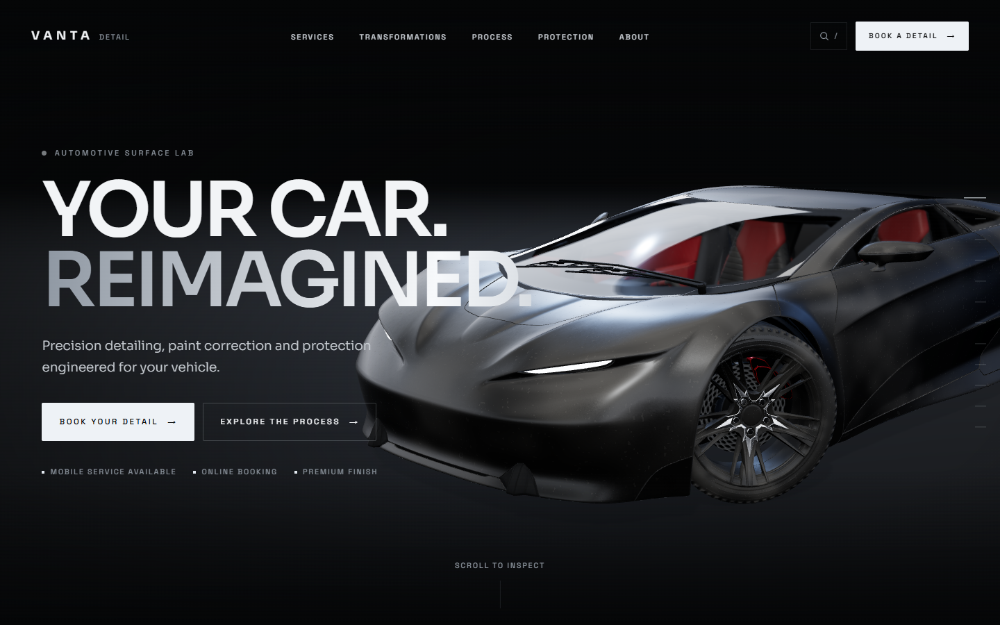
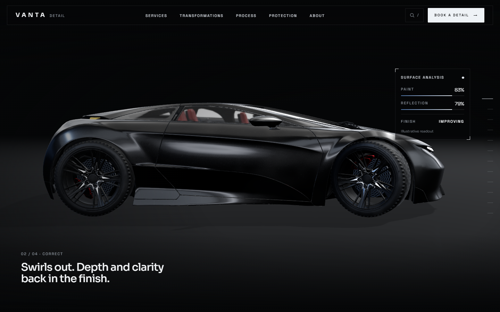
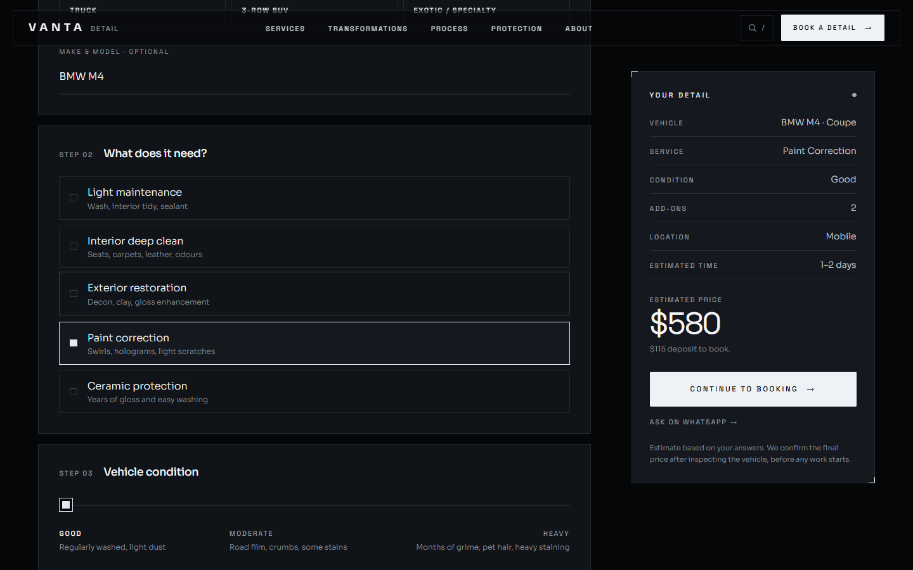
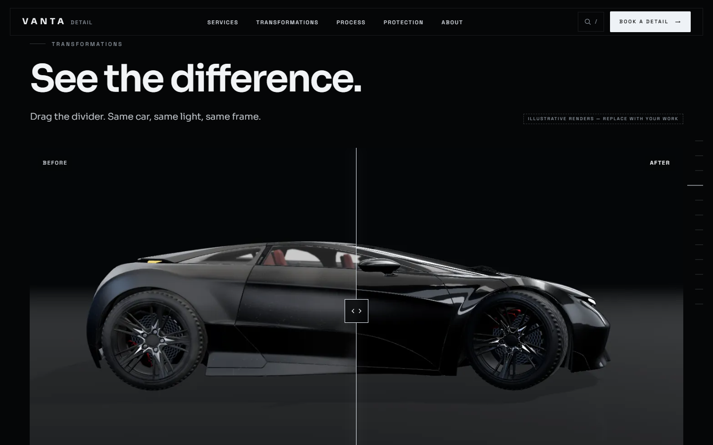
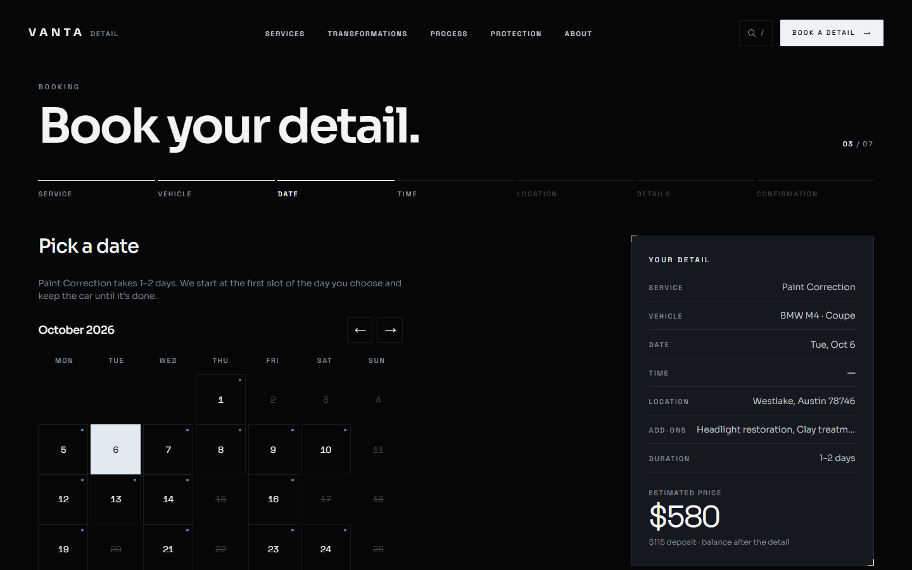
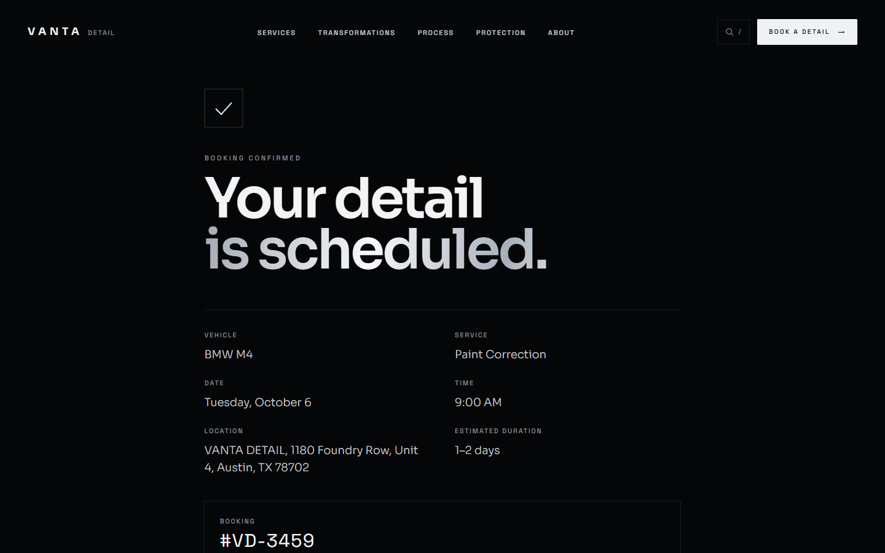
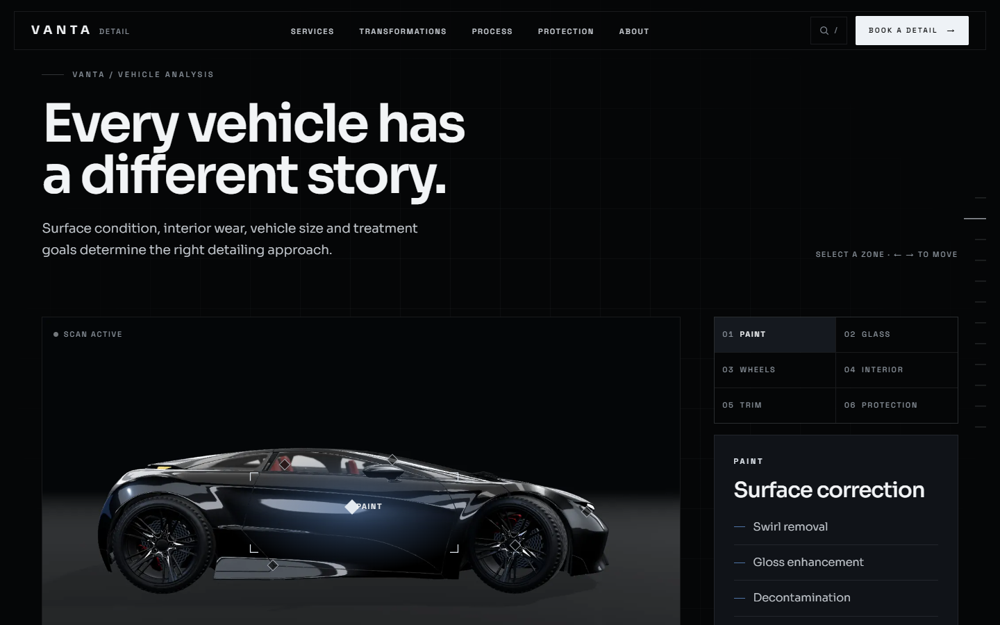
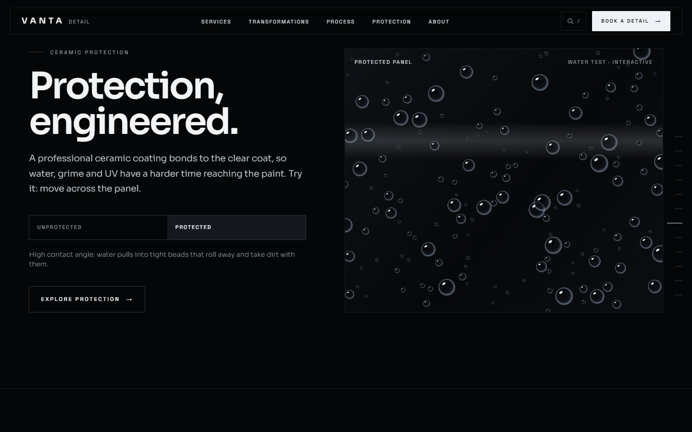
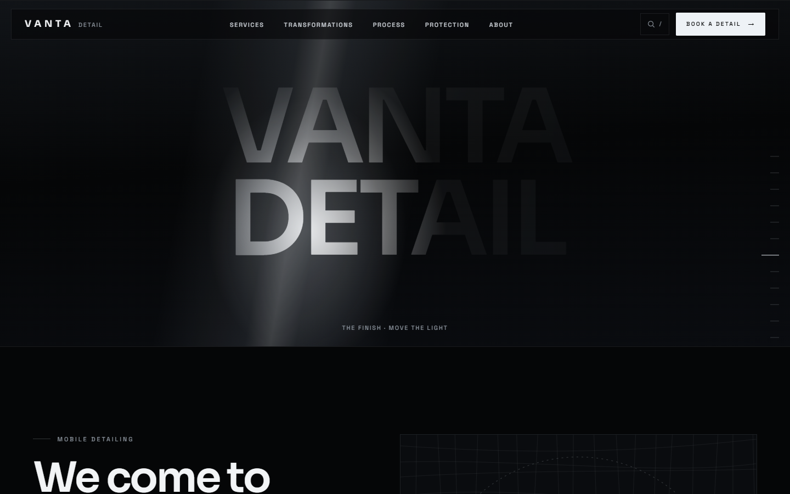
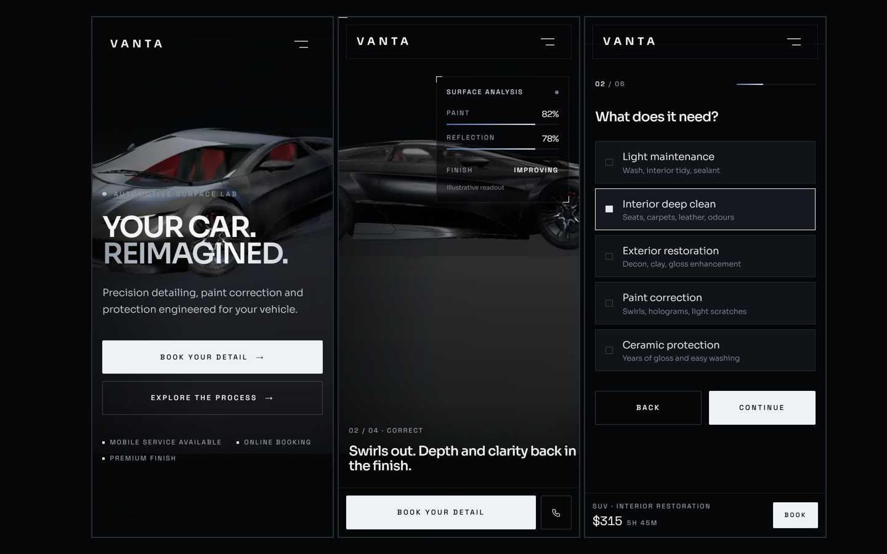

# VANTA DETAIL — Automotive Detailing Website Template

**Your car. Reimagined.** A premium, cinematic website template for car detailing businesses:
a scroll-driven 3D vehicle that gets cleaner as you scroll, a live quote builder, vehicle-size
pricing and a real seven-step booking flow.

**[Live demo](https://vanta-detail-muad1.vercel.app)** · **[Get the template ($49)](https://muadme.gumroad.com/l/wdpgn)**

## Promo video

A 35-second vertical promo built from the site's own 3D scene and real screens: [watch on X](https://x.com/MuadDevvlxn/status/2105318561442853010) · [watch on Instagram](https://www.instagram.com/mouad.webdev/reel/Dd6qwFGJiQm/).

## What's inside

- **Scroll-driven 3D hero** — the camera circles a realistic car (front ¾ → front → side → rear → paint
  close-up) while the dust clears, with a small surface-analysis readout. Phones and weak devices get
  a pre-rendered scroll sequence instead of live WebGL.
- **Vehicle-size pricing** — choose Sedan, SUV, Truck… and every price on the site updates from one config.
- **Quote builder** — vehicle, service, condition, add-ons, service-area check with travel fee, photo
  upload and a live estimate. One question per screen on phones.
- **Booking in seven steps** — service, vehicle, calendar, time, location, details, confirmation with a
  booking number, Google Calendar / .ics and a prefilled WhatsApp message.
- **Before/after sliders**, a filterable transformation gallery and a fullscreen lightbox.
- **Interactive explainers** — a vehicle "detailing scan", a paint surface lab, a water-beading demo that
  reacts to the cursor, paint-correction levels, ceramic packages and interior hotspots.
- Memberships (monthly / annual), fleet enquiries, a service finder, a mobile-service map, testimonials,
  a journal, FAQ, a "/" quick-nav and a light theme. 14 pages plus service and article pages.

## Built with

React 19 · TypeScript · Vite · Tailwind CSS v4 · three.js / React Three Fiber · React Router.
Content lives in a few documented config files; the demo booking engine runs in the browser and has
two functions to swap for a real calendar API.

**Lighthouse** (production build): desktop Performance 99 · mobile 86–94 · Accessibility 95–100 ·
Best Practices 100 · SEO 100.

All imagery is rendered from the site's own 3D scene. The 3D car is "Car Concept" by Eric Chadwick /
Darmstadt Graphics Group, CC BY 4.0 (modified, logos removed).

## More templates

- [SYNTRA](https://github.com/Muaddd1/SYNTRA) — AI business command center SaaS template with an AI command palette, an approval queue with audit log, a visual workflow builder and five AI agents ([demo](https://syntra-muad1.vercel.app))
- [NEXFORM](https://github.com/Muaddd1/NEXFORM) — futuristic personal-trainer template with a 3D athlete, a personalisation quiz, a 3D body map and a real booking flow ([demo](https://nexform-muad1.vercel.app))
- [FADEHOUSE](https://github.com/Muaddd1/FADEHOUSE) — premium barbershop template with a real booking flow and a 3D clipper built in code ([demo](https://fadehouse-muad1.vercel.app))
- [ÉLORA](https://github.com/Muaddd1/ELORA) — luxury beauty-salon template with a real booking flow and a 3D serum bottle ([demo](https://elora-muad1.vercel.app))
- [VELLUTO](https://github.com/Muaddd1/VELLUTO) — cinematic 3D coffee-brand template with a scroll-driven espresso cup ([demo](https://velluto-muad1.vercel.app))
- [AURELIA](https://github.com/Muaddd1/AURELIA) — luxury e-commerce React template ([demo](https://aurelia-template-phi.vercel.app))
- [VANTA](https://github.com/Muaddd1/VANTA) — premium digital-product storefront template ([demo](https://vanta-creator-os.vercel.app))
- [AURUM](https://github.com/Muaddd1/AURUM) — luxury gold jewelry template with a live gold price calculator and Arabic RTL ([demo](https://aurum-template-muad1.vercel.app))
- [PLINTH](https://github.com/Muaddd1/PLINTH) — single-file interior design studio template ([demo](https://plinth-template.vercel.app))
- [GOLDEN CRUST](https://github.com/Muaddd1/GOLDEN-CRUST) — pizza restaurant template with a 3D pizza hero ([demo](https://golden-crust-muad1.vercel.app))

---

This repository is a showcase. The full source code is available as a paid template.
Built by [Mouad Sehli](https://muad-portfolio.vercel.app).
